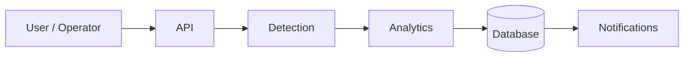
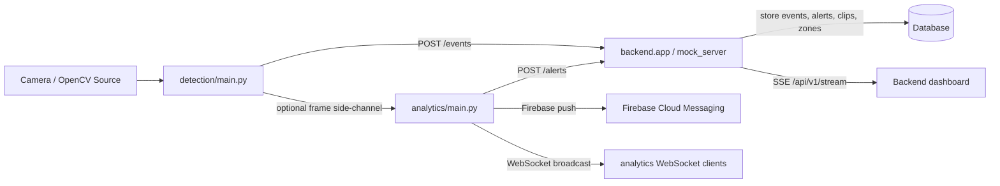
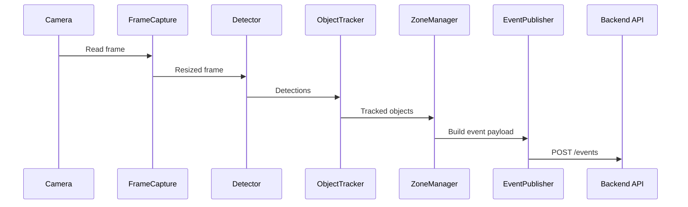
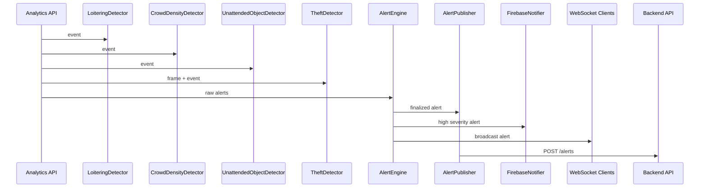

# Project Architecture

This repository contains a three-part smart transit security prototype:

- `detection/` captures camera frames, tracks objects, builds detection events, and posts them to an API.
- `analytics/` consumes detection events, derives security alerts, writes clip artifacts, and fans alerts out to the backend and Firebase.
- `backend/` stores events, alerts, clips, zones, and analytics results, and serves the dashboard and read APIs.

The codebase also contains legacy and transitional modules. The live runtime path is not perfectly aligned with the newer repository/service/Alembic layer, so this document separates:

- `wired into the current app startup`
- `supporting or legacy modules that are present but not on the main runtime path`

## Repository Map

### Top Level

- `mock_server.py` - thin entry point that runs `backend.app:app` with Uvicorn on port 8000.
- `docker-compose.yml` - PostgreSQL service definition for local development.
- `transit_security.db` - local SQLite database file currently present in the workspace.
- `docs/` - previous architecture and handoff notes.
- `detection/` - real-time frame analysis pipeline.
- `analytics/` - alert derivation and notification pipeline.
- `backend/` - FastAPI backend, ORM models, repositories, services, migrations, and dashboard HTML.
- `docker/` - PostgreSQL initialization SQL.

### `detection/`

Wired runtime files:

- `main.py`
- `capture.py`
- `detector.py`
- `tracker.py`
- `zone_manager.py`
- `event_publisher.py`
- `config.py`
- `zones.json`

Tests:

- `tests/test_capture.py`
- `tests/test_detector.py`
- `tests/test_tracker.py`
- `tests/test_zone_manager.py`
- `tests/test_event_publisher.py`

### `analytics/`

Wired runtime files:

- `main.py`
- `alert_engine.py`
- `alert_publisher.py`
- `firebase_notifier.py`
- `crowd_density.py`
- `loitering_detector.py`
- `theft_detector.py`
- `unattended_object.py`
- `config.py`

Tests:

- `tests/test_alert_engine.py`
- `tests/test_crowd_density.py`
- `tests/test_firebase_notifier.py`
- `tests/test_loitering_detector.py`
- `tests/test_theft_detector.py`
- `tests/test_unattended_object.py`

### `backend/`

Wired runtime files:

- `app.py`
- `config.py`
- `database/__init__.py`
- `database/base.py`
- `database/deps.py`
- `database/transactions.py`
- `database/types.py`
- `routes/health.py`
- `routes/events.py`
- `routes/zones.py`
- `routes/clips.py`
- `routes/stats.py`
- `services/cameras.py`

Supporting / transitional files:

- `database/session.py`
- `services/alerts.py`
- `services/analytics_results.py`
- `services/events.py`
- `services/health.py`
- `services/stats.py`
- `services/zones.py`
- `repositories/*`
- `schemas/*`
- `models/*`
- `alembic/*`
- `static/index.html`
- `tests/*`

Important note:

- `backend/models/__init__.py` defines a legacy simplified ORM set.
- `backend/models/*.py` defines a newer PostgreSQL-oriented ORM set.
- `backend/database/__init__.py` defines the runtime `Base`, engine, and `init_db()` used by `backend.app`.
- `backend/database/base.py` defines a separate `Base` used by Alembic and the newer model files.

That means the repository currently contains two schema tracks, and they are not fully unified.

### `docker/`

- `postgres/init/01-create-test-db.sql` - initialization script for the PostgreSQL container.

## Runtime Entry Points

- `python detection/main.py` starts the camera-to-event pipeline.
- `python analytics/main.py` starts the alert-processing API and WebSocket broadcaster.
- `python mock_server.py` starts the backend API by launching `backend.app:app`.
- `uvicorn backend.app:app` is the backend server entry used by the README.
- `alembic -c backend/alembic.ini upgrade head` runs database migrations.

## End-to-End Architecture

### Logical Flow Requested

### Actual Runtime Flow

The live code executes the following physical flow:

## Startup Sequence

### Backend Startup

`backend.app:create_app()` is the backend bootstrap path.

1. Load settings from `backend.config.get_settings()`.
2. Create the FastAPI app with lifespan handlers.
3. Install CORS middleware.
4. Register exception handlers and request logging middleware.
5. Create the clips directory under `CLIPS_BASE_DIR`.
6. Build the async SQLAlchemy engine and sessionmaker.
7. Store settings, engine, sessionmaker, and readiness state on `app.state`.
8. Open one session and call `ensure_default_camera(session)`.
9. `ensure_default_camera()` calls `init_db()` and seeds zones from `detection/zones.json` if the zone table is empty.
10. Mark the app ready and serve routes.
11. On shutdown, clear readiness and dispose the engine.

### Detection Startup

`detection/main.py` is the detection bootstrap path.

1. Configure logging.
2. Instantiate `FrameCapture`.
3. Instantiate `Detector`.
4. Instantiate `ObjectTracker`.
5. Instantiate `ZoneManager` with `detection/zones.json`.
6. Instantiate `EventPublisher`.
7. Enter the forever loop:
   - read frame
   - detect objects
   - track objects
   - build event payload
   - publish to the backend
   - draw overlays
   - display the frame

### Analytics Startup

`analytics/main.py` is the analytics bootstrap path.

1. Configure logging.
2. Create the `clips/` directory.
3. Instantiate all detectors:
   - `LoiteringDetector`
   - `CrowdDensityDetector`
   - `UnattendedObjectDetector`
   - `TheftDetector`
4. Instantiate the `AlertEngine`.
5. Instantiate the `FirebaseNotifier`.
6. Instantiate the `AlertPublisher`.
7. Initialize an empty frame cache.
8. Accept `/frame` uploads and `/events` JSON events.
9. On shutdown, close the alert publisher client.

## Service and Module Map

### Detection Service

- `FrameCapture` opens the camera and resizes frames.
- `Detector` loads YOLO11n and filters detections by class and confidence.
- `ObjectTracker` wraps DeepSORT and keeps stable object IDs.
- `ZoneManager` loads polygons from `zones.json`, tests centroid membership, and tracks dwell time.
- `EventPublisher` posts events to `http://localhost:8000/events` by default.

### Analytics Service

- `LoiteringDetector` emits raw loitering alerts once per object after dwell time passes a threshold.
- `CrowdDensityDetector` emits crowd surge alerts when the person count crosses thresholds.
- `UnattendedObjectDetector` emits unattended baggage alerts after a bag remains isolated for long enough.
- `TheftDetector` uses MediaPipe pose landmarks and motion/proximity heuristics.
- `AlertEngine` deduplicates raw alerts, assigns severity, and writes clip files.
- `AlertPublisher` posts finalized alerts to the backend alert ingestion endpoint.
- `FirebaseNotifier` sends high-severity alerts to Firebase Cloud Messaging when configured.
- `ConnectionManager` broadcasts finalized alerts to connected WebSocket clients.

### Backend Service

- `backend.app` exposes the API, SSE stream, static dashboard, and compatibility aliases.
- `routes/events.py` handles event and alert ingestion plus alert streaming.
- `routes/zones.py` handles zone CRUD.
- `routes/clips.py` reads clip metadata.
- `routes/stats.py` aggregates dashboard statistics.
- `routes/health.py` reports readiness state.
- `services/cameras.py` seeds the database from zone configuration.

### Supporting Backend Layers

- `repositories/` implements reusable async persistence helpers.
- `services/events.py`, `services/alerts.py`, `services/analytics_results.py`, `services/zones.py`, `services/stats.py` provide a more structured domain layer.
- `database/base.py`, `models/*.py`, and `alembic/versions/0001_initial.py` define the PostgreSQL-oriented schema track.

## Data Flow

### Detection Data Flow

1. OpenCV captures a frame.
2. YOLO11n detects relevant objects.
3. DeepSORT assigns persistent IDs.
4. Zone polygons are loaded and tested.
5. Dwell time is accumulated per object and zone.
6. `main.py` builds a JSON event:
   - `frame_id`
   - `timestamp`
   - `objects[]`
7. `EventPublisher` posts the event to the API.
8. The OpenCV preview renders zone and object overlays locally.

### Analytics Data Flow

1. The analytics API receives a detection event.
2. Raw detectors generate candidate alerts.
3. Restricted-zone violations are synthesized directly from the event objects.
4. `AlertEngine` deduplicates alerts by type and object ID.
5. `AlertEngine` calculates severity and creates a local clip from buffered frames.
6. `AlertPublisher` posts finalized alerts to the backend.
7. `FirebaseNotifier` optionally pushes high-severity alerts to FCM.
8. `ws_manager` pushes alerts to connected WebSocket clients.

### Backend Data Flow

1. The backend receives event, alert, frame, zone, or clip requests.
2. SQLAlchemy sessions are created per request from `app.state.sessionmaker`.
3. Event and alert rows are inserted.
4. Clip rows are created when alert clip paths are provided.
5. Queries return alerts, incidents, zones, clips, and aggregated stats.
6. The dashboard consumes the same read APIs and the SSE stream.

## API Flow

### Detection to Backend

- `POST /events` is the primary detection ingestion path.
- `POST /frame` exists as a compatibility path for frame uploads.

### Backend APIs

- `GET /health/`
- `GET /dashboard`
- `POST /api/v1/events`
- `POST /api/v1/alerts`
- `POST /api/v1/frame`
- `GET /api/v1/alerts`
- `GET /api/v1/alerts/{alert_id}`
- `GET /api/v1/incidents`
- `GET /api/v1/incidents/{alert_id}`
- `GET /api/v1/zones/`
- `POST /api/v1/zones/`
- `GET /api/v1/zones/{zone_id}`
- `DELETE /api/v1/zones/{zone_id}`
- `GET /api/v1/clips/`
- `GET /api/v1/clips/{alert_id}`
- `GET /api/v1/stats/`
- `GET /api/v1/stream`

### Analytics APIs

- `POST /frame`
- `POST /events`
- `WS /ws/analytics`

## Database Flow

### Active Runtime Schema Track

The runtime backend currently uses the legacy ORM definitions from `backend/models/__init__.py` through `backend/database/__init__.py`.

Likely tables in that active track:

- `zones`
- `events`
- `alerts`
- `clips`

### PostgreSQL-Oriented Schema Track

The newer ORM and migration layer defines:

- `cameras`
- `zones`
- `events`
- `alerts`
- `clips`
- `analytics_results`

It also defines explicit relationships and indexes for production-style query patterns.

### Storage Responsibilities

- `events` stores detection telemetry.
- `alerts` stores analytics output and alert metadata.
- `clips` stores local video artifact references.
- `zones` stores polygon configuration.
- `analytics_results` stores detector outputs tied to source events in the newer schema track.
- `cameras` stores camera metadata in the newer schema track.

## Detection Flow

Details:

- The detection loop is continuous and best-effort.
- Publishing failures are logged but do not stop frame processing.
- Dwell timing is maintained in memory inside `ZoneManager`.
- Overlay rendering is local and does not affect backend persistence.

## Analytics Flow

Details:

- `loitering`, `crowd_surge`, `unattended_object`, `theft_gesture`, and `restricted_zone` are the supported alert types in the current analytics code.
- `AlertEngine` deduplicates by `(alert_type, object_id)` inside a configured window.
- `AlertEngine` stores clip files under `analytics/clips/`.
- Firebase is optional and only initializes when the credentials file and SDK are present.

## Event Flow

### Raw Event Path

1. Detection emits a frame event.
2. Event publisher sends it to the backend or mock backend endpoint.
3. Backend persists the event.
4. Analytics also consumes the event stream when pointed at the same payload.

### Alert Path

1. Analytics generates raw alerts.
2. Alert engine finalizes the alerts.
3. Finalized alerts are posted to the backend.
4. Backend persists alert rows and optional clip rows.
5. Backend SSE delivers alerts to dashboard clients.
6. Firebase delivers push notifications for eligible alerts.

## Service Dependencies

### Detection Dependencies

- `opencv-python`
- `ultralytics`
- `torch`
- `deep-sort-realtime`
- `numpy`
- `httpx`

### Analytics Dependencies

- `fastapi`
- `uvicorn`
- `opencv-python`
- `numpy`
- `httpx`
- `mediapipe`
- `firebase-admin`

### Backend Dependencies

- `fastapi`
- `uvicorn`
- `sqlalchemy`
- `pydantic`
- `pydantic-settings`
- `python-multipart`
- `aiosqlite`
- database driver support depending on `DATABASE_URL`

### Infrastructure Dependencies

- PostgreSQL container in `docker-compose.yml`
- Local SQLite file `transit_security.db`
- `detection/zones.json` as a shared zone source
- `analytics/firebase_config.json` when Firebase is enabled

## External Integrations

- OpenCV camera capture and visualization
- YOLO11n object detection via Ultralytics
- DeepSORT tracking via `deep_sort_realtime`
- MediaPipe Pose for theft-gesture heuristics
- Firebase Cloud Messaging for push notifications
- HTTP transport between detection, analytics, and backend services
- PostgreSQL through Docker, with Alembic migrations for the newer schema track

## Compatibility and Legacy Notes

- `mock_server.py` is not a separate mock implementation anymore; it simply launches the backend application.
- The repository still contains documentation that refers to a mock server and to a backend split that has since evolved.
- `backend/tests/test_api.py` and some other tests reflect an older contract in places, so they should be treated as compatibility evidence rather than authoritative runtime behavior.
- The current live runtime should be understood from `backend/app.py`, `detection/main.py`, and `analytics/main.py`.

## Practical Summary

- Detection is the source of telemetry.
- Analytics is the source of alerts and notifications.
- Backend is the persistence and dashboard layer.
- The database is the system of record.
- Firebase and SSE/WebSocket streams are the notification outputs.
- There is an important schema split between the legacy runtime ORM and the newer PostgreSQL-oriented ORM/migration track.
