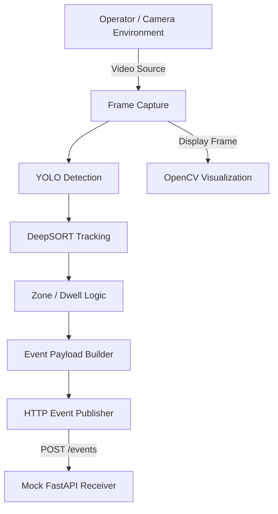
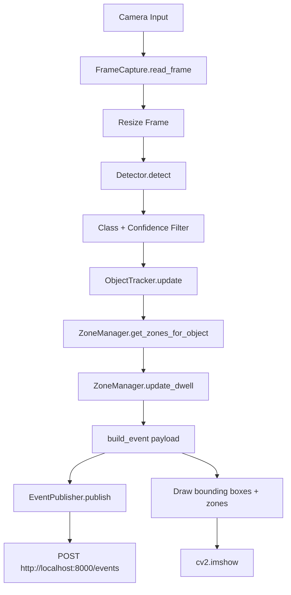
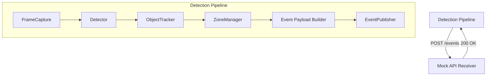

# Pipeline Maps

## High-Level System Architecture


## Runtime Execution Pipeline


## Module Dependency Graph
```mermaid
flowchart TD
    main --> capture
    main --> detector
    main --> tracker
    main --> zone_manager
    main --> event_publisher
    main --> config
    detector --> config
    tracker --> 
    zone_manager --> 
    event_publisher --> config
    capture --> 
```

## API Flow Diagram

